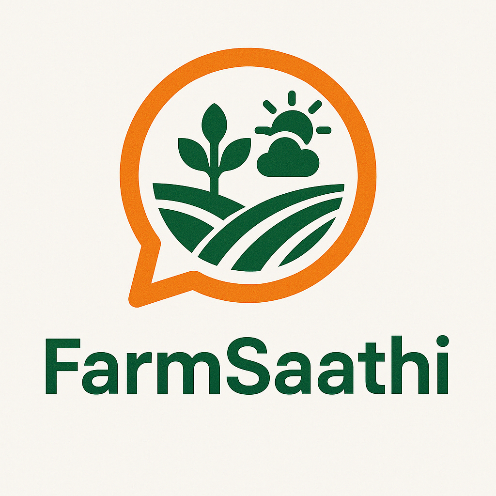

# FarmSaathi 🌾
## Empowering Farmers with AI-Driven Agricultural Assistance


[](https://nodejs.org/)
[](https://www.mongodb.com/)
[](https://reactjs.org/)
[](https://www.tensorflow.org/)
[](https://tailwindcss.com/)
[](https://huggingface.co/)
[](https://keras.io/)

## Overview
FarmSaathi is an accessible agricultural assistance platform designed to bridge the technology gap for farmers across India. With voice-enabled features in multiple regional languages (Hindi, English, and Punjabi), FarmSaathi provides critical agricultural information, personalized crop recommendations, and financial guidance through an intuitive interface.

🔗 **Live Website:** [http://farmsathipragatiai.netlify.app](http://farmsathipragatiai.netlify.app)

**Watch Walkthrough of the website (Highly Recommended!):** [YouTube Demo](https://www.youtube.com/watch?v=1gsWaDogjxM)

## Key Features
### Voice-Enabled Multilingual Support
* Complete voice interface in Hindi, English, and Punjabi
* Speech-to-text and text-to-speech capabilities for farmers with varying levels of literacy
* Natural language processing for intuitive interactions

### Weather-Based Crop Recommendations
* Intelligent crop suggestions based on local weather forecasts
* Personalized recommendations considering farm size, soil type, and local climate
* Real-time weather alerts and farming advisories

### Image Recognition for Crop Analysis
* Upload images of crops to identify diseases, pests, and nutrient deficiencies
* Visual growth tracking and yield estimation
* Actionable insights for crop management

### Financial Support Information
* Up-to-date information on government schemes and subsidies
* Agricultural loan programs and eligibility criteria
* Financial planning tools for seasonal farming operations

### Optional User Profiles
* Store farm details for personalized recommendations
* Track crop history and performance
* Phone number-based easy authentication

## Technology Stack
### Frontend
* React for web interface
* Tailwind CSS for responsive UI components
* Redux for state management

### Backend
* Node.js server with Express.js framework
* MongoDB for flexible data storage
* JWT authentication for secure access

### AI/ML Components
* TensorFlow and Keras for deep learning models
* Hugging Face for NLP and multilingual support
* ChromaDB for vector storage and semantic search
* RAG (Retrieval Augmented Generation) for intelligent information retrieval
* Google Cloud Vision API integration for image analysis
* OpenWeatherMap API for weather forecasts
* Custom NLP models for multilingual voice processing

## Installation
### Prerequisites
* Node.js (v16.0+)
* MongoDB (v5.0+)
* Python (v3.8+) for ML components
* NPM or Yarn package manager

### Setup Instructions
1. Clone the repository
```bash
git clone https://github.com/yourusername/farmsaathi.git
cd farmsaathi
```

2. Install dependencies
```bash
# Install backend dependencies
cd server
npm install
# Install frontend dependencies
cd ../client
npm install
# Install ML dependencies
cd ../ml
pip install -r requirements.txt
```

3. Environment setup
```bash
# In the server directory
cp .env.example .env
# Edit the .env file with your configuration
```

4. Run the application
```bash
# Start the server (from server directory)
npm run dev
# Start the client (from client directory)
npm start
```


## Coming Soon
* Mobile application for Android and iOS using React Native
* Offline capabilities for areas with limited connectivity
* Enhanced voice features with more regional languages including Tamil, Telugu, Kannada and Bengali
* IoT integration for farm equipment monitoring

---
**Made for Indian Farmers**
